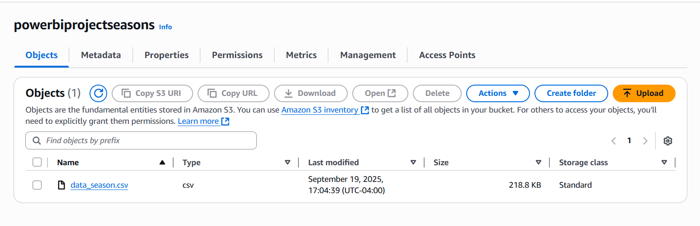

# Agriculture Seasons Dashboard (Datasource: AWS S3 → Snowflake → Power BI)

### Dashboard Link : https://app.powerbi.com/reportEmbed?reportId=18f74121-0e2e-4c10-a2b4-55ab7ec10af0&autoAuth=true&ctid=4190cc35-fd93-4aa6-9817-c1121132f7e2

## Problem Statement

This dashboard provides an end-to-end analysis of agricultural performance across multiple dimensions, enabling stakeholders to monitor Rainfall, Temperature, Humidity, and Yield. The report offers insights into environmental conditions and their relationship to crop production, seasons, and geographical locations.

Through the visuals, users can analyze average rainfall, temperature, humidity, and yields by year, by season, by crop, and by location, highlighting critical trends and variations. For instance, rainfall patterns are compared against crop categories like paddy, tea, and coffee, while yield performance is assessed across regions such as Mysuru, Kodagu, and Raichur.

The solution integrates AWS S3 for data storage, Snowflake for data transformation, and Power BI for visualization, ensuring secure, scalable, and automated workflows. Transformations such as rainfall group categorization and year grouping further enhanced the analytical depth of the dataset

Overall, this dashboard empowers researchers, policymakers, and agricultural businesses to make data-driven decisions regarding crop planning, irrigation strategies, and seasonal productivity optimization, ultimately improving agricultural sustainability and profitability.

### Steps followed 

- Step 1 : A dedicated AWS S3 bucket named powerbiprojectseasons was created to store the raw agriculture dataset. The CSV file data_season was uploaded to this bucket, making it available for secure cloud-based integration.

- Step 2 : An IAM role with the AmazonS3FullAccess policy was configured, and its ARN was generated for Snowflake integration. Snowflake’s external ID was added to the trust policy, ensuring secure connectivity between AWS S3 and Snowflake.
- Step 3: In Snowflake, a new database, schema, and table were created to host the agriculture data. An external stage was defined to connect to the S3 bucket, and the dataset was loaded into Snowflake using the COPY INTO command. Data validation was carried out through SELECT queries.

- Step 4 : Data profiling was performed in Snowflake to check column distributions, ranges, null values, and distinct counts. SQL aggregation queries and Snowflake’s visualization features were used to review initial patterns such as rainfall by season and crop.

- Step5 : Transformations were applied to enhance the dataset. Rainfall values were increased by 10%, area values decreased by 10%, and new engineered columns were added:

 - year_group (Y1, Y2, Y3 based on year ranges)

 - rainfall_groups (low: 255–1200, high: >2800–4103).
Updates were validated using SQL queries and visual checks

- Step 6 : Power BI Desktop was connected to Snowflake via the native connector. The agriculture table was imported, and Power Query Editor was used for column profiling and verification of data quality.
- Step 7 : A four-page Power BI report was created, each page focusing on one key metric—Rainfall, Temperature, Humidity, and Yield. For each metric, the following visuals were included:
Stacked bar chart of averages by Year
Stacked bar chart of averages by Season
Stacked bar chart of averages by Crop
Stacked bar chart of averages by Location
- Step 8: A cohesive theme was applied through Power BI’s View tab, aligning all pages under a unified report style. The final report was published to Power BI Service, delivering an end-to-end cloud-native workflow for agricultural analysis.

# Snapshot of Dashboard (Power BI Service)

 

 

## Insights  

The dashboard provides a four-page analysis of rainfall, temperature, humidity, and yield patterns across years, crops, seasons, and locations.

On the **Rainfall Analysis page**, the yearly rainfall fluctuated between **2.7K** and **3.2K**, showing relatively stable patterns. Seasonal averages were similar, with Rabi at 3105, **Kharif at 3097, and Zaid at 3070**. Among crops, Paddy recorded the highest rainfall requirement at **3.5K**, while Coconut and Pepper averaged around 3.0K. At the location level, **Bangalore** had the highest average rainfall at **3.8K**, whereas Mysuru had the lowest at 2.9K.

The Temperature Analysis page showed yearly temperatures ranging from **41 to 73**, with most years between 68 and 72. Seasonally, **Kharif and Zaid were the warmest at 72**, while Rabi was cooler at 61. Crop analysis revealed that **Ginger experienced the highest average temperature at 79**, and Cardamom the lowest at 55. Location-wise, Bangalore was the hottest at 186, while Chikmagalur was the coolest at 33.

On the Humidity Analysis page, both yearly and seasonal averages were highly consistent at **55–56**. Crops such as Cotton, Pepper, and Coffee maintained an average of 56, whereas Cashew, Ginger, and Cardamom stayed at 55. Locations also showed similar stability, with most regions at 56, and Bangalore and Kasaragodu slightly lower at 55.

Finally, the Yield Analysis page highlighted strong variations across years and crops. Yields ranged between **16.4K and 28.7K**, peaking in recent years. Seasonally, **Rabi produced the highest yields at 24.9K**, while Kharif lagged behind at 20.2K. Crop-level analysis showed Cotton as the most productive crop with yields of **51K**, while Cashew had the lowest at just 3K. Location-level insights revealed that **Kodagu (29K) and Mysuru (28K)** were top performers, while Davangere recorded the lowest yield at 12K.

Overall, the dashboard highlights how rainfall, temperature, and humidity directly impact crop yields, providing actionable insights for seasonal planning and regional crop strategies.
